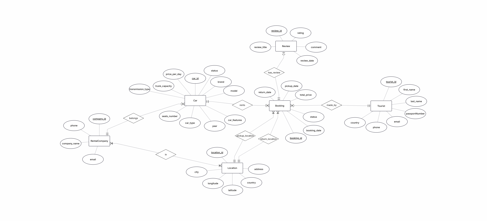

# Rent Cars System  
Avital Hoyzer  
Moriya Kalfon
---

## Table of Contents
- Phase 1: Design and Build the Database  
  - Introduction  
  - AI Screens  
  - ERD (Entity-Relationship Diagram)  
  - DSD (Data Structure Diagram)  
  - Design Decisions  
  - SQL Scripts  
  - Data Insertion Methods  
  - Backup & Restore  

---

# Phase 1: Design and Build the Database  

## Introduction  
The Rent Cars Database is designed to manage a car rental system efficiently.  
It stores and organizes information about rental companies, cars, tourists (customers), bookings, locations, and reviews.

The system allows tracking of car availability, managing bookings, storing customer details, and collecting reviews for completed rentals.

### Purpose of the Database  
This database provides a structured solution for:

- Managing rental companies and their available cars  
- Tracking car details such as type, price, and availability  
- Handling customer (tourist) information  
- Managing bookings including pickup and return locations  
- Storing reviews for completed bookings  
- Supporting multiple locations for rental companies  

### Potential Use Cases  
- Customers can book cars, choose pickup/return locations, and leave reviews  
- Rental companies can manage their fleet and availability  
- System administrators can track bookings and analyze usage  
- The system ensures organized and consistent data storage  

---

## AI Screens  
The system interface was created using AI Studio:

🔗 https://ai.studio/apps/0398fed9-b445-44e4-9e85-60cfa2ea6518  

---

## ERD (Entity-Relationship Diagram)  

## DSD (Data Structure Diagram)  

---

## Design Decisions  

Several important design decisions were made:

- **Separation between Tourist and Booking**  
  Each tourist can make multiple bookings → one-to-many relationship  

- **Car belongs to Rental Company**  
  Each car is owned by exactly one company  

- **Company and Location (Many-to-Many)**  
  Implemented using `company_location` table  

- **Booking includes locations**  
  Pickup and return locations are stored as foreign keys  

- **Review depends on Booking**  
  Each booking can have at most one review  

- **Normalization**  
  The database is normalized to reduce redundancy and improve consistency  

---

## SQL Scripts  

### Create Tables Script  
📜 `phase1/scripts/createTables.sql`

### Insert Data Script  
📜 `phase1/scripts/insertTables.sql`

### Drop Tables Script  
📜 `phase1/scripts/dropTables.sql`

### Select All Script  
📜 `phase1/scripts/selectAllTables.sql`

---

## Data Insertion Methods  

### 1. Mockaroo (CSV Files)  
Used to generate realistic data for tables:

- Tourist data  
📜 `phase1/csvFiles/touristMOCK_DATA.csv`

- Additional SQL files generated by Mockaroo  
📜 `phase1/mockarooFiles/`

---

### 2. SQL Insert Scripts  
Manual and generated SQL scripts were used:

📜 `insertTables.sql`

Used to insert structured and relational data into all tables  

---

### 3. (Optional – if you used another tool)  
You can describe another method here (Python / GenerateData / etc.)

---

## Backup & Restore  

### Backup  
The database backup was created using pgAdmin.  
The backup file is stored in `.backup` format.

(Add screenshot here)

---

### Restore  
The backup was successfully restored using pgAdmin restore functionality.

(Add screenshot here)

---

## Notes  
- The system was developed using PostgreSQL  
- Managed through pgAdmin  
- Running inside Docker environment  
