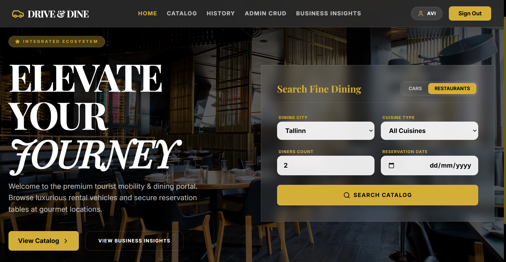

# Phase 5: Full Stack Web Application Integration

---

## Introduction
This final phase introduces a fully functional, end-to-end Web Application interface for the **Drive & Dine (Rent Cars & Restaurants Integrated System)**. 
The application transitions the system from raw SQL terminal interactions into an intuitive, visually stunning graphical user interface (GUI). It allows tourists to seamlessly book cars and reserve restaurant tables, while providing administrators with powerful tools to manage the database and generate business analytics.

---

## Architecture & Tools Used

The application was built using a modern JavaScript/TypeScript stack, carefully separating the client interface from the database logic.

### 1. Frontend (Client-Side)
* **Framework:** React (v19) with TypeScript.
* **Styling:** Tailwind CSS, utilizing a premium "Glassmorphism" aesthetic with deep black, gold, and frosted glass elements.
* **Animations:** Framer Motion (`motion`) for smooth page transitions and interactive micro-animations.
* **Build Tool:** Vite, for lightning-fast development and hot-module replacement.
* **Structure:** A Single Page Application (SPA) utilizing state-based routing to seamlessly transition between Home, Catalog, User History, Admin CRUD, and Business Insights screens.

### 2. Backend (Server-Side)
* **Environment:** Node.js with Express.js.
* **Role:** Acts as the REST API middleware, securely bridging the React frontend and the PostgreSQL database.
* **Endpoints:** Exposes dynamic routes (`/api/tables/:tableName`) for generic CRUD operations, as well as specialized routes (`/api/queries`, `/api/functions`, `/api/procedures`) to trigger the advanced PL/pgSQL logic developed in Phase 4.

### 3. Database
* **System:** PostgreSQL.
* **Driver:** `pg` (node-postgres) module.
* **Integration:** The backend securely connects to `IntegratedDB` and utilizes the existing schemas, views, triggers, and functions without altering the core data structures built in previous phases.

---

## How to Run the Application

To run the full stack application locally on your machine, you must run both the backend server and the frontend client simultaneously.

### Prerequisites
* **Node.js** installed on your machine.
* **PostgreSQL** running locally with the `IntegratedDB` database fully populated (as per Phases 1-4).

### Step 1: Start the Backend Server
Open your terminal, navigate to the `front` folder inside `phase5`, and start the Express API server:
```bash
cd phase5/front
npm install
npm run server
```
*The backend server will initialize and listen for database requests on port 5000.*

### Step 2: Start the Frontend React Application
Open a **new** terminal window, navigate to the same `front` directory, and start the Vite development server:
```bash
cd phase5/front
npm run dev
```
*The frontend application will launch. Open your browser and navigate to `http://localhost:3000` to use the app.*

---

## Application Walkthrough & Screens

### 1. Home Page & Search Interface
The main entry point for tourists. Users can switch between searching for luxury vehicles or fine dining, setting their desired pickup locations, cities, and dates.



### 2. Inventory Catalog
Displays the available rental cars and restaurants based on the user's search criteria. Features dynamic image rendering and interactive selection cards.


### 3. Checkout & Booking
A smooth, integrated booking experience where users review their selected asset, provide necessary details (like the number of guests), and finalize their reservation securely.


### 4. Admin CRUD Interface
An exclusive, dynamic control panel for system administrators. It automatically reads the database schemas and provides a form-based interface to perform Create, Read, Update, and Delete operations on any table in the system without writing SQL.


### 5. Business Insights (Analytics & Routines)
A powerful administrative dashboard connected directly to the PL/pgSQL logic from Phase 4.
* **Queries:** View available cars in Jerusalem and high-rated vehicles.
* **Functions:** Calculate the city performance index and stream tourist activity logs (Cursors).
* **Procedures:** Execute the `pr_apply_strategic_discounts` procedure to dynamically update prices with the click of a button.


